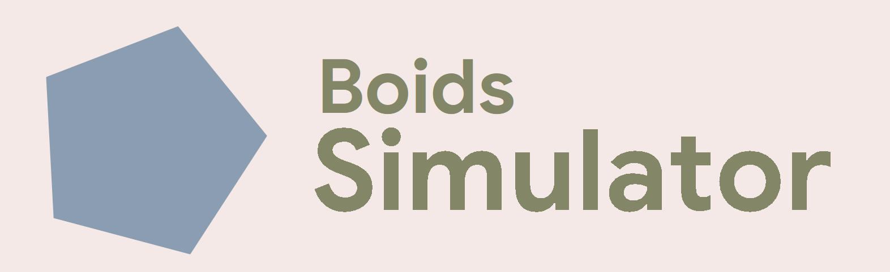

# Boids Simulator


[](https://cppreference.com/c/23)
[](https://cppreference.com/cpp/26)
[](https://github.com/skypjack/entt/releases/tag/v3.16.0)
[](https://github.com/SFML/SFML/releases/tag/3.1.0)


A simple flocking simulation.
> **Disclaimer: This is a proof-of-concept. The current implementation is $O(n^2)$ and is poorly optimized. Refactoring and spatial partitioning are planned for future milestones.**

> **WARNING: The velocity of entities aren't still clamped. if the velocity is too high, it can cause total freeze.**

## Technical Architecture

- This project only supports **Windows** platform as it uses **Win32 API**.

| Specification | Value |
| :--- | :--- |
| **Toolchain** | CMake 4.0+ |
| **C++ Standard** | C++26 |
| **C Standard** | C23 |
| **Linking** | Fully ***Static*** |

### Dependencies
- **[EnTT](https://github.com/skypjack/entt/releases/tag/v3.16.0) v3.16.0** — Entity Component System (ECS)
- **[SFML](https://github.com/SFML/SFML/releases/tag/3.1.0) 3.1.0** — Multimedia & Rendering Layer

> **Note:** All dependencies are managed via CMake's `FetchContent`. They will be automatically cloned and linked during the configuration phase — no manual dependency installation required.

## Build instruction
Coming soon!

## The simulation logic (how it actually works)
The simulation implements **Craig Reynolds' Steering Behaviors**:
- **[Separation](#separation)**: Entities apply a repulsive force to maintain a minimum buffer distance, preventing local congestion.
- **[Alignment](#alignment)**: Entities match their velocity vectors with the local average to achieve directional flocking consensus.
- **[Cohesion](#cohesion)**: Entities steer toward the neighborhood's centroid (center of mass) to maintain group density.

#### Variables
There are some values we can tune to result with different results:
- **Separation** $w_s$: Separation gain
- **Alignment** $w_a$: Alignment gain
- **Cohesion** $w_c$: Cohesion gain

... And a small value:
- **Vision range** $l_{vision}$: Vision range of entities, which affects how far the neighborhood selection applies.

#### Separation
This behavior prevents local congestion by applying a force inversely proportional to the distance between boids. 

Given that $A$ is the current position of an entity, let $N$ be the set of neighbors that is inside the vision range of the mentioned entity, we can get this specific vector that tells us the direction to move and the intensity:

$$\overrightarrow{k}=\sum_{B\in N}\frac{\overrightarrow{BA}}{|\overrightarrow{BA}|^2}$$

The notation $|\overrightarrow{BA}|$ calculates the length of the vector $\overrightarrow{BA}$, according to the **Pythagorean theorem formula**, we can get:

$$|\overrightarrow{BA}|=\sqrt{(x_A-x_B)^2+(y_A-y_B)^2}$$
$$\implies|\overrightarrow{BA}|^2=(x_A-x_B)^2+(y_A-y_B)^2$$

Given that $\Delta x=x_A-x_B$ and $\Delta y=y_A-y_B$, we can get:

$$\overrightarrow{BA}=(\Delta x;\Delta y)$$
$$\implies|\overrightarrow{BA}|^2=\Delta x^2+\Delta y^2$$

Then, we can calculate $x$ and $y$ axis separately (just as what the CPU has to do):

$$k_x=\sum_{B\in N}\frac{\Delta x}{|\overrightarrow{BA}|^2}=\sum_{B\in N}\frac{\Delta x}{\Delta x^2+\Delta y^2}$$
$$k_y=\sum_{B\in N}\frac{\Delta y}{|\overrightarrow{BA}|^2}=\sum_{B\in N}\frac{\Delta y}{\Delta x^2+\Delta y^2}$$

> As we can see, $|\overrightarrow{BA}|$ is at the denominator of the fraction, which means that $|\overrightarrow{BA}|$ should not equal $0$, which can cause the program to crash. That's why we only check if the distance is larger than $0.01$ for mentioned safety issues.
>
> Here is a piece of pseudo-C++ code:
> ```cpp
> float dx = this_p.x - other_p.x; // Calculate Δx
> float dy = this_p.y - other_p.y; // Calculate Δy
> float distance = std::sqrtf(dx * dx + dy * dy); // Calculate distance
>
> if (distance <= vision_range && distance > 0.01f){
>   /// Do anything else here
> }
> ```

Given that $\overrightarrow{u}$ is a direction vector of $\overrightarrow{k}$ that has a length $|\overrightarrow{u}|=1$ (in other words, this is an **unit vector**). To calculate it (again, with some **Pythagorean theorem**):

$$\overrightarrow{u}=\frac{\overrightarrow{k}}{|\overrightarrow{k}|}=\frac{\overrightarrow{k}}{\sqrt{k_x^2+k_y^2}}$$

Because $\overrightarrow{k}$ varies significantly over time, we have to get its direction (we already did it and have $\overrightarrow{u}$), and apply a constant $v_{max}$ for all of the time. Then, we can get the desired velocity vector $\overrightarrow{v_{desired}}$:

$$\overrightarrow{v_{desired}}=\overrightarrow{u}\cdot v_{max}$$

But there is a small problem. the current velocity of the entity, $\overrightarrow{v_A}$, ain't be the same as our $\overrightarrow{v_{desired}}$, as it always has its own velocity. That's why we have to calculate the **steering force** $\overrightarrow{F_s}$:

$$\overrightarrow{F_s}=\overrightarrow{v_{desired}}-\overrightarrow{v_A}$$

#### Alignment
This behavior ensures that an entity moves in the same direction as its neighbors, creating a synchronized "flocking" effect.

> And yeah, this part only uses **$A$ as an entity**, the **set $N$ of its neighbors** and **maximum velocity**, $v_{max}$, from [separation section](#separation), **other variables are *separated***. Please pay attention!

First, we have to calculate the average velocity of all neighbors:

$$\overrightarrow{v_{average}}=\frac{1}{n(N)}\sum_{B\in N}\overrightarrow{v_B}$$

This can be split into 2 axis:

$$v_{{average}_x}=\frac{1}{n(N)}\sum_{B\in N}v_{B_x}$$
$$v_{{average}_y}=\frac{1}{n(N)}\sum_{B\in N}v_{B_y}$$

Given that $\overrightarrow{u}$ is a direction vector of $\overrightarrow{v_{average}}$, and also an unit vector (length equal $1$), to calculate it:

$$\overrightarrow{u}=\frac{\overrightarrow{v_{average}}}{|\overrightarrow{v_{average}}|}=\frac{\overrightarrow{v_{average}}}{\sqrt{v_{average_x}^2+v_{average_y}^2}}$$

> As we can see, $|\overrightarrow{v_{average}}|$ is at the denominator, which means that when it approaches $0$, our variable overflows (as it easily surges over $\pm3.4\cdot10^{38}$ with `float` data type, single-precision), or even cause the program to crash if it actually equals $0$. To ensure safety, we have to set the $\overrightarrow{u}=(0;0)$ when $|\overrightarrow{v_{average}}|$ is too low ($0.000001$ for example).

Then we scale it with $v_{max}$ to get the desired velocity:

$$\overrightarrow{v_{desired}}=\overrightarrow{u}\cdot v_{max}$$

The same as separation process, we also have to calculate the steering force based on the difference of the desired velocity $v_{desired}$ and the current velocity $v_A$ of the entity:

$$\overrightarrow{F_a}=\overrightarrow{v_{desired}}-\overrightarrow{v_A}$$

#### Cohesion
This behavior ensures the entities steer to the average position (center of mass) of the neighbors, keeping the group united.

> I have to say it again, this part only uses **$A$ as an entity**, the **set $N$ of its neighbors** and **maximum velocity**, $v_{max}$, from [separation section](#separation), **other variables are *separated***. Please pay attention!

First, we have to calculate the average position of all neighbors, also means the center of this set $N$:

$$P_{center}=\frac{1}{n(N)}\sum_{B\in N}P_B$$

This can be split into 2 axis:

$$x_{P_{center}}=\frac{1}{n(N)}\sum_{B\in N}P_{B_x}$$
$$y_{P_{center}}=\frac{1}{n(N)}\sum_{B\in N}P_{B_y}$$

As we want the entity to move from the current position $P_A$ toward this center position $P_{center}$, we have to calculate vector $\overrightarrow{P_AP_{center}}$. We know that at $O(0;0)$:

$$\overrightarrow{P_AP_{center}}$$
$$=\overrightarrow{P_AO}+\overrightarrow{OP_{center}}$$
$$=\overrightarrow{OP_{center}}-\overrightarrow{OP_A}$$
$$=(x_{center}-x_A;y_{center}-y_A)$$

Let $\overrightarrow{k_{cohesion}} = \overrightarrow{P_AP_{center}}$. To ensure the entity moves at a constant speed, we get the direction (unit vector $\overrightarrow{u}$) of $\overrightarrow{k_{cohesion}}$:

$$\overrightarrow{u}=\frac{\overrightarrow{k_{cohesion}}}{|\overrightarrow{k_{cohesion}}|} = \frac{\overrightarrow{k_{cohesion}}}{\sqrt{{k_{cohesion_x}^2+k_{cohesion_y}^2}}}$$

> As we can see, $|\overrightarrow{k_{cohesion}}|$ is at the denominator, which means that when it approaches $0$, our variable overflows (as it easily surges over $\pm3.4\cdot10^{38}$ with `float` data type, single precision), or even cause the program to crash if it actually equals $0$. To ensure safety, we have to set the $\overrightarrow{u}=(0;0)$ when $|\overrightarrow{k_{cohesion}}|$ is too low ($0.000001$ for example).

Then we scale it with $v_{max}$ to get the desired velocity:

$$\overrightarrow{v_{desired}}=\overrightarrow{u}\cdot v_{max}$$

Finally, we calculate the **steering force** $\overrightarrow{F_c}$ by finding the difference between $\overrightarrow{v_{desired}}$ and the current velocity $\overrightarrow{v_A}$ of the entity:

$$\overrightarrow{F_c}=\overrightarrow{v_{desired}}-\overrightarrow{v_A}$$

#### At the end
Finally, we sum everything up together to get the **final acceleration for the entity**:

$$\overrightarrow{a_A}=w_s\cdot\overrightarrow{F_s}+w_a\cdot\overrightarrow{F_a}+w_c\cdot\overrightarrow{F_c}$$

**With:**
- $w_s$ : The gain of separation.
- $w_a$ : The gain of alignment.
- $w_c$ : The gain of cohesion.
- $\overrightarrow{F_s}$, $\overrightarrow{F_a}$, $\overrightarrow{F_c}$ : The forces that we calculated before.
