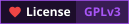

# Boids Simulator

<div id="badges" align="center">

<picture>
  <source media="(prefers-color-scheme: dark)" srcset="banner/boids_simulator_dark.svg">
  <source media="(prefers-color-scheme: light)" srcset="banner/boids_simulator_light.svg">
  
</picture>

<h3>A simple flocking simulation.</h3>

[](https://cppreference.com/cpp/26)
[](https://github.com/SFML/SFML/releases/tag/3.1.0)
[](LICENSE)

</div>

---

## About This Simulation

The simulation implements **Craig Reynolds' Steering Behaviors**:

- **Separation:** Entities apply a repulsive force to maintain a minimum buffer distance, preventing local congestion.
- **Alignment:** Entities match their velocity vectors with the local average to achieve directional flocking consensus.
- **Cohesion:** Entities steer toward the neighborhood's centroid (center of mass) to maintain group density.

| Separation                                  | Alignment                                  | Cohesion                                  |
| ------------------------------------------- | ------------------------------------------ | ----------------------------------------- |
|  |  |  |

_(Image source: [Boids - Wikipedia](https://en.wikipedia.org/wiki/Boids))_

---

## Technical Architecture

This project supports **Windows** and **Partially Linux** (Only tested on **Arch Linux**).

Ensure you have a modern C++ compiler supporting C++26 (`clang++ >= 18` or `g++ >= 14`), along with **CMake 4.0+** and a build generator like **Ninja** or **Make**.

| Specification     | Value                                                                                     |
| :---------------- | :---------------------------------------------------------------------------------------- |
| **CMake Version** | CMake 4.0+                                                                                |
| **C++ Standard**  | C++26                                                                                     |
| **Linking**       | Static Linking (**Windows Only**), Dynamic Linking (**Other Platforms, including Linux**) |

### Dependencies

- **[SFML 3.1.0](https://github.com/SFML/SFML/releases/tag/3.1.0)** — Multimedia & Rendering Layer

> **Note:** All dependencies are managed via CMake's `FetchContent`. They will be automatically cloned and linked during the configuration phase — no manual dependency installation required. **(Except Linux users, they must install SFML's dependencies through system's package manager)**

---

## Build instruction

### On Windows

On Windows, SFML and its runtime dependencies are automatically pulled, and are statically compiled directly into the binary - no pre-installed system packages or DLL management are required.

1. **Clone the repository:**

   ```powershell
   git clone https://github.com/AstraDreamers/BoidsSimulator.git
   cd BoidsSimulator
   ```

2. **Configure the project:**

   ```powershell
   cmake -B build -G Ninja -DCMAKE_BUILD_TYPE=Release
   ```

3. **Build the project:**

   ```powershell
   cmake --build build --config Release
   ```

4. **Run the application:**

   ```powershell
   .\build\BoidsSimulator.exe
   ```

### On Arch Linux

On Linux, SFML is built dynamically. You must install the system-level development libraries for X11, OpenGL, FreeType, and audio codecs before configuring.

1. **Install required dependencies:**

   ```bash
   sudo pacman -S --needed \
       base-devel \
       git \
       cmake \
       ninja \
       clang \
       libxrandr \
       libxcursor \
       libxi \
       libxrender \
       libx11 \
       systemd-libs \
       freetype2 \
       flac \
       libvorbis \
       libogg \
       mesa \
       mbedtls
   ```

2. **Clone the repository:**

   ```bash
   git clone https://github.com/AstraDreamers/BoidsSimulator.git
   cd BoidsSimulator
   ```

3. **Configure the project:**

   ```bash
   cmake -B build -G Ninja -DCMAKE_BUILD_TYPE=Release
   ```

4. **Build the project:**

   ```bash
   cmake --build build
   ```

5. **Run the application:**

   ```bash
   build/BoidsSimulator
   ```

---

## Contributors

**Many thanks for the contributors!**

[](https://github.com/AstraDreamers/BoidsSimulator/graphs/contributors)

---

## References & Citations

- [Boids - Wikipedia](https://en.wikipedia.org/wiki/Boids)
